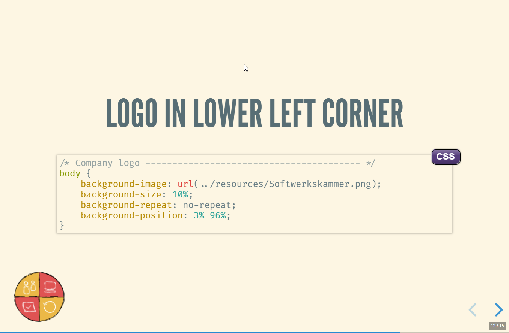
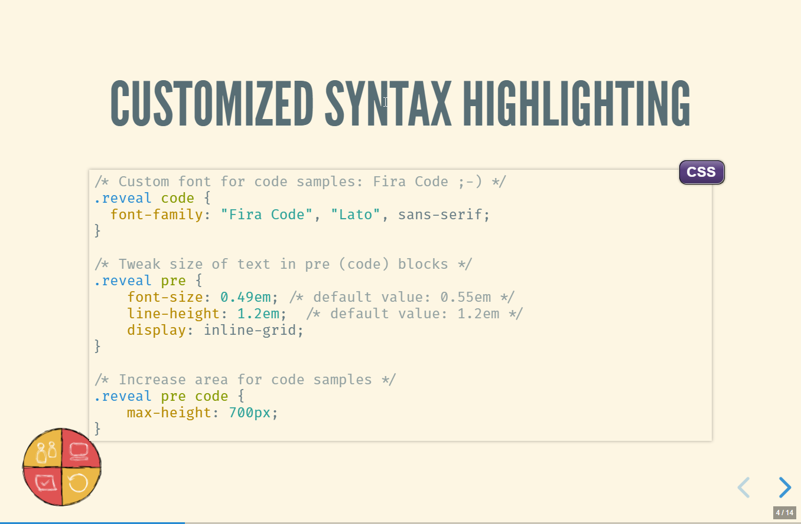
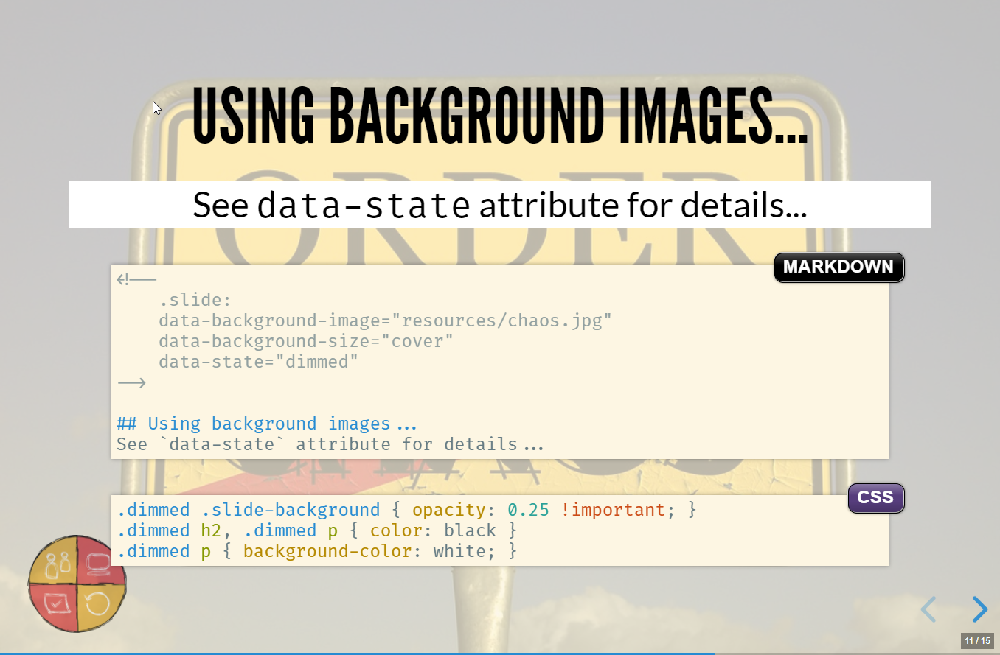
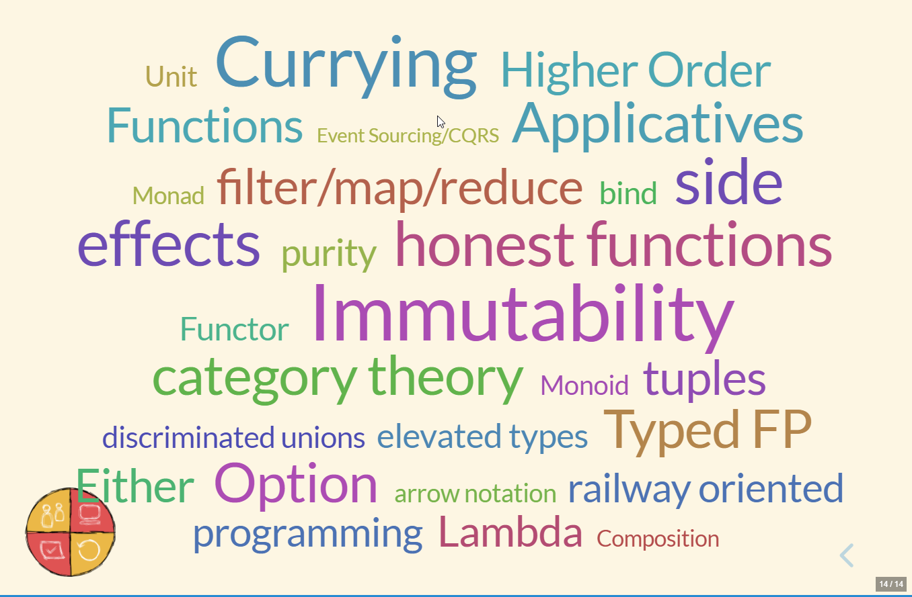
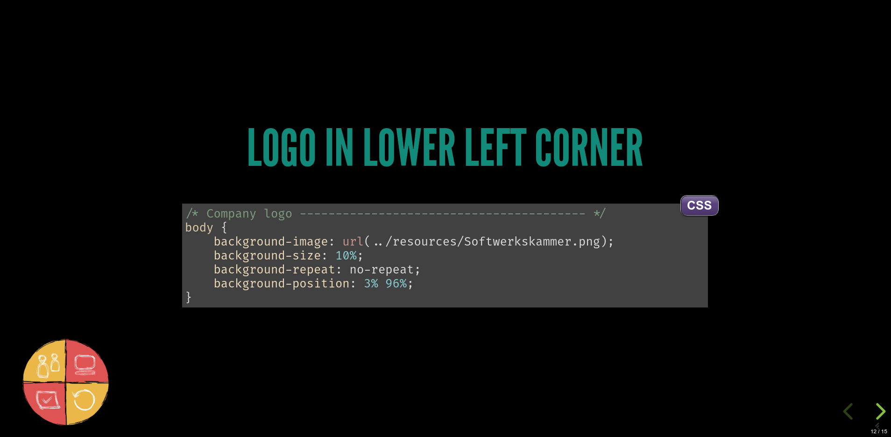
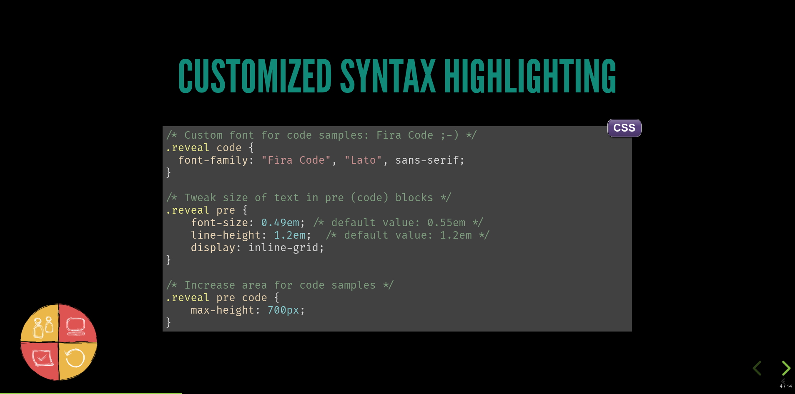
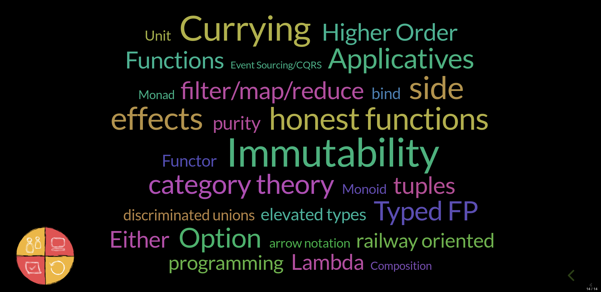

Template for using [revealjs](https://github.com/hakimel/reveal.js).

# Idea

- Clone this repo
- Run the install script
- You have a clean new start for your presentation

# Prerequisites

- wget
- tar

Tested with Linux and Windows.

Using RevealJs obviously requires NodeJs. This setup does not require NodeJs.

# Initial setup 

There are 2 theme templates: 
- dark
- light (default).

After cloning this repo:

- Option 1: Light theme. Run `./setup.sh`.
    - It will create a template with a light background template.
- Option 2: Dark theme. Run `./setup.sh --dark`.
    - It will create a template with a dark background template.
- The `setup.sh` script will remove the `.git` folder so you can start from scratch.
- `cd slides && npm install && npm start`

That's it!

How to run a linux bash script on windows?

- easiest solution: minimal bash shell included with Git-for-windows (`git bash`)
- Or the Full-Linux Support with Windows10. 
- Or Cygwin. 
- Or...

# Project structure

- `slides`: the revealjs presentation

# Showcases

- [x] Background images with markdown
- [x] Change highlighting of code samples (step by step)
- [x] slide customizations using `data-*` attributes in markdown
- [x] company logo on each slide

# Screenshots

## Light theme

## Dark theme

# Printing notes for usage during presentation

Although reveal.js provides a nice notes feature, I seldomly stand infront of the presentation laptop to view them.
Therefore I prefer printed slides with some space for hand-written notes.

The file `convert2notes.sh` uses `pdfjam` to convert a pdf 1-page-per-slide to multiple-pages-to-slide. It requires a TeX installation.
